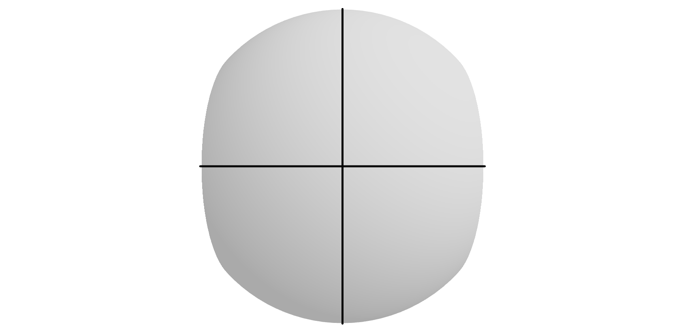

     

Loomis Viz is a simple visualization of the Loomis Method by Andrew Loomis. 
If you want to try it out for yourself, go to https://loomis-viz.vercel.app/.

## Roadmap
- [x] THREE.js for 3D -> 2D Projection 
- [x] Optional cranium clipping
- [x] Saving the scene as png
- [ ] Optional Visualization for the jaw
- [ ] Dark Theme
